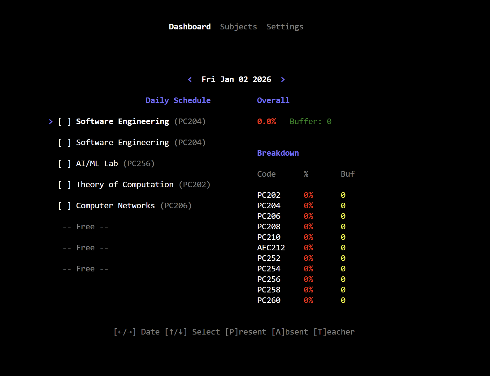
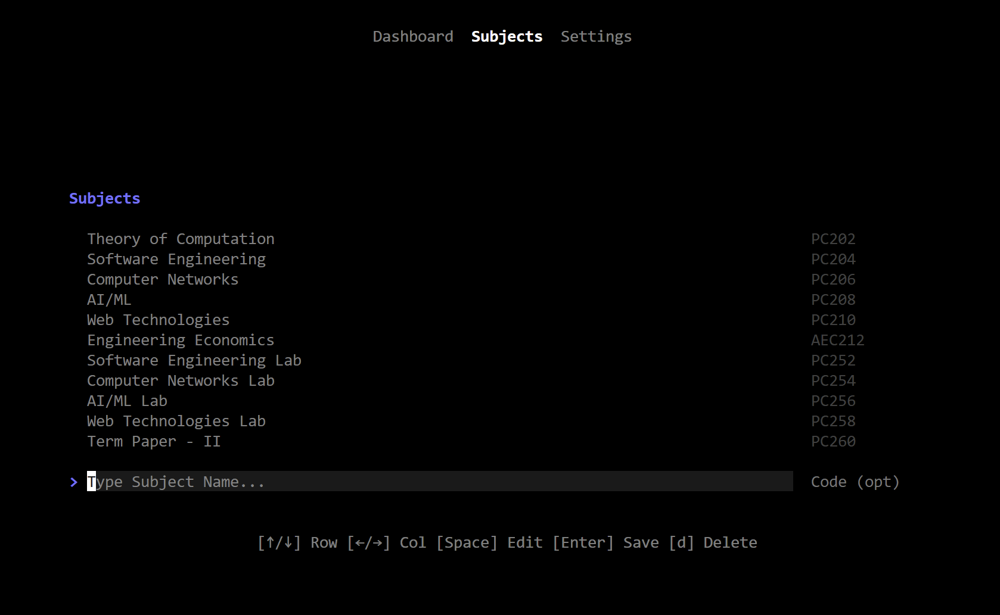
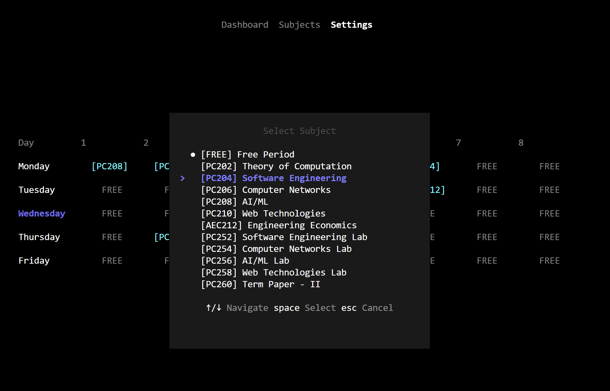
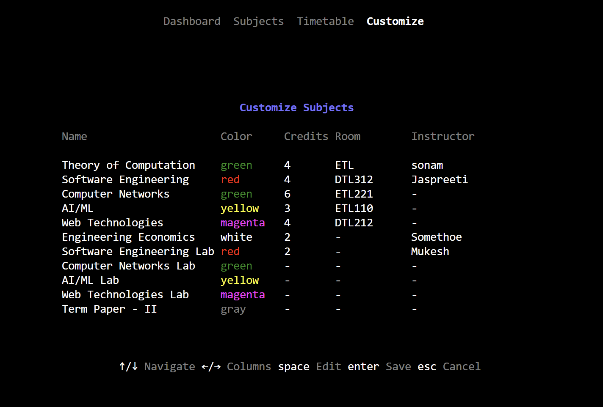
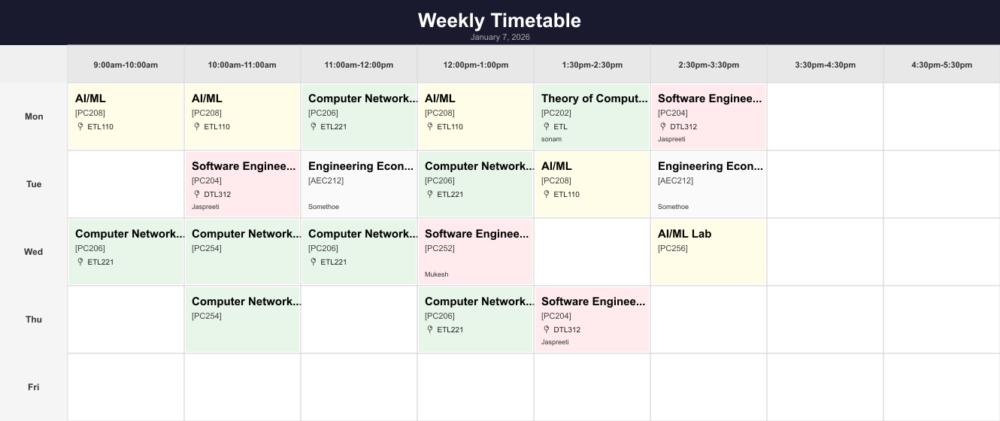

# Attendance Tracker TUI

A personal attendance tracking terminal user interface built with [Bun](https://bun.sh) and [OpenTUI](https://github.com/sst/opentui). Log your daily attendance, manage subjects, create timetables, and track your attendance statistics right from the terminal.

## Screenshots

| Dashboard | Subjects |
|---|---|
|  |  |
| **Timetable** | **Customize** |
|  |  |

### Timetable Image Export

Generate a professional PNG image of your weekly timetable to share or print.



## Features

- **Subject Management** - Add, edit, and remove subjects with names and codes
- **Weekly Timetable** - Configure 8 class slots for each weekday (Monday-Friday)
- **Daily Attendance Logging** - Mark attendance as Present (P), Absent (A), or Teacher Absent (T)
- **Statistics Dashboard** - View overall and per-subject attendance percentages
- **Smart Buffer Calculation** - See how many classes you can safely miss while maintaining 75% attendance
- **Persistent Storage** - All data saved automatically to `~/.attendancehehe/`
- **Keyboard-First Navigation** - Fully keyboard accessible with intuitive shortcuts
- **Subject Customization** - Assign colors, credits, rooms, and instructors to subjects for color-coded timetable display
- **Image Export** - Generate beautiful PNG images of your weekly timetable to share or print

## Prerequisites

- [Bun](https://bun.sh) runtime (version 1.0 or later)
- Terminal with true color support (most modern terminals)
- For image export: [node-canvas](https://github.com/Automattic/node-canvas) dependencies

## Installation

### From Source

```bash
# Clone the repository
git clone git@github.com:Arjunsharmahehe/attendancehehe.git
cd attendancehehe

# Install dependencies
bun install

# Run in development mode
bun run dev
```

### Run Directly

```bash
bun run src/index.tsx
```

## Project Structure

```
attendance-tracker/
├── src/
│   ├── index.tsx              # Entry point
│   ├── app.tsx                # Main app with view navigation
│   ├── context/
│   │   └── app-context.tsx    # Global state & data management
│   ├── components/
│   │   ├── color-dialog.tsx       # Color selection dialog
│   │   ├── customize-row.tsx      # Customize page row component
│   │   ├── daily-schedule.tsx     # Daily schedule display
│   │   ├── daily-schedule-row.tsx # Individual slot row
│   │   ├── overall-stats.tsx      # Statistics panel
│   │   ├── schedule-cell.tsx      # Timetable cell
│   │   ├── schedule-row.tsx       # Timetable day row
│   │   ├── subject-dialog.tsx     # Subject selection dialog
│   │   ├── subject-row.tsx        # Subject list item
│   │   ├── new-subject-row.tsx    # New subject input
│   │   └── timetable-modal.tsx    # Timetable preset selection modal
│   ├── pages/
│   │   ├── customize.tsx      # Subject customization page
│   │   ├── dashboard.tsx      # Main dashboard (attendance logging)
│   │   ├── subjects.tsx       # Subject management page
│   │   └── settings.tsx       # Timetable configuration page
│   └── utils/
│       └── timetable-renderer.ts  # PNG image generation
├── package.json
├── tsconfig.json
└── README.md
```

## Usage

### Navigation

| Key | Action |
|-----|--------|
| `Tab` | Switch between views (Dashboard → Subjects → Timetable → Customize → Dashboard) |
| `Ctrl+g` | Generate timetable image |
| `q` | Quit application |

### Dashboard View

The main dashboard shows today's schedule and allows you to log attendance.

| Key | Action |
|-----|--------|
| `↑` / `↓` | Select class slot |
| `←` / `→` | Navigate to previous/next day |
| `p` | Mark as Present |
| `a` | Mark as Absent |
| `t` | Mark as Teacher Absent |

### Subjects View

Manage your subjects list.

| Key | Action |
|-----|--------|
| `↑` / `↓` | Navigate through subjects |
| `←` / `→` | Switch between Name and Code columns |
| `Space` | Start editing selected subject |
| `Enter` | Save changes |
| `d` | Delete selected subject |
| `Esc` | Cancel editing |

### Timetable View (Settings)

Configure your weekly class schedule (8 slots per day).

| Key | Action |
|-----|--------|
| `↑` / `↓` | Navigate days |
| `←` / `→` | Navigate slots |
| `Space` | Start editing cell (opens subject dialog) |
| `↑` / `↓` (in dialog) | Navigate through subjects |
| `Space` (in dialog) | Select subject |
| `Esc` (in dialog) | Cancel |
| `Ctrl+r` | Reset entire schedule |

### Customize View

Customize subject details including color coding, credits, room number, and instructor name. Color-coded subjects will be displayed with their assigned colors in the timetable.

| Key | Action |
|-----|--------|
| `↑` / `↓` | Navigate through subjects |
| `←` / `→` | Navigate columns (Name, Color, Credits, Room, Instructor) |
| `Space` (on Color) | Open color selection dialog |
| `Space` (on other fields) | Start editing |
| `Enter` | Save changes |
| `Esc` | Cancel editing |
| `Backspace` | Delete characters while editing |
| `Shift+key` | Type uppercase letters |

#### Color Selection Dialog

| Key | Action |
|-----|--------|
| `W` / `S` or `↑` / `↓` | Navigate colors |
| `Space` or `Enter` | Select color |
| `X` or `Esc` | Cancel |

### Timetable Image Export

Generate a professional PNG image of your weekly timetable to share or print.


| Key | Action |
|-----|--------|
| `Ctrl+g` | Open preset selection modal |
| `↑` / `↓` | Navigate through presets |
| `Space` or `Enter` | Generate image |
| `Esc` | Cancel |

The generated image is saved to your home directory as `timetable-YYYY-MM-DD.png`.

## Data Storage

All data is stored in `~/.attendancehehe/` directory:

- `subjects.json` - List of subjects (including color, credits, room, instructor)
- `schedule.json` - Weekly timetable configuration
- `master.csv` - Attendance records (date,slot,subjectId,status)
- `timetable-presets.json` - Custom timetable time slot presets

## Timetable Presets

The application includes built-in time slot presets for common schedules:

- **Standard (9-1, 1:30-5:30)** - 9:00am-10:00am, 10:00am-11:00am, 11:00am-12:00pm, 12:00pm-1:00pm, 1:30pm-2:30pm, 2:30pm-3:30pm, 3:30pm-4:30pm, 4:30pm-5:30pm
- **Schools-1 (8-11, 11:15-2:15)** - Aligned to school morning schedules

When generating a timetable image, select the preset that matches your class timing.

## Statistics Explained

The application calculates two key metrics for attendance tracking:

- **Buffer**: Number of classes you can safely miss while maintaining 75% attendance threshold
- **Lag**: Number of additional classes you need to attend to reach 75% if currently below

These calculations help you understand:
- If you're above 75%, the buffer shows how many classes you can skip
- If you're below 75%, the lag shows how many more classes you must attend to recover

## Tech Stack

- **Runtime**: [Bun](https://bun.sh) - Fast JavaScript runtime
- **TUI Framework**: [OpenTUI](https://github.com/sst/opentui) - React renderer for terminal UIs
- **UI Library**: React 19
- **Language**: TypeScript
- **Image Generation**: [node-canvas](https://github.com/Automattic/node-canvas) - Canvas implementation for Node.js

## License

MIT License - feel free to use and modify for your needs.

## Contributing

Contributions are welcome! Please feel free to submit issues and pull requests.
